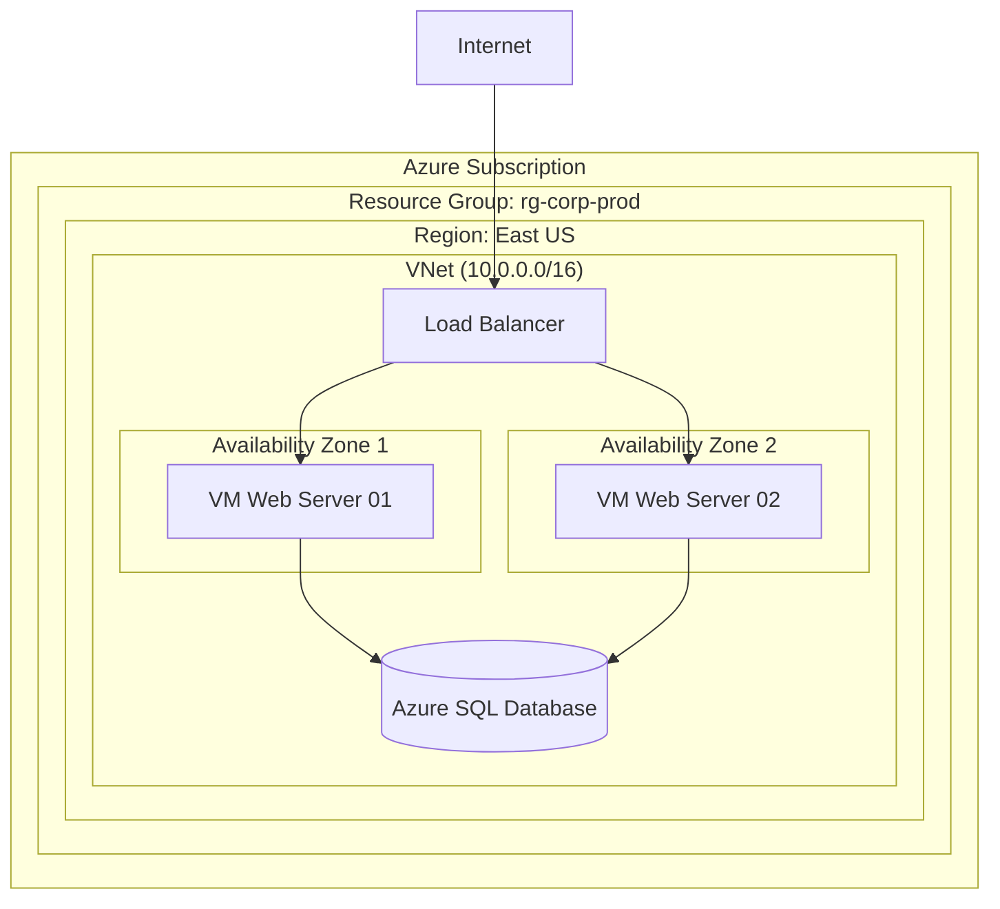

# azure-architecture-components
 
# Componentes de Arquitetura no Azure
# Componentes de arquitectura en Azure

Este repositório apresenta o desenho de uma solução arquitetural utilizando os principais componentes de organização e infraestrutura do Microsoft Azure, focado em **Alta Disponibilidade** e **Organização Lógica**.

## Objetivo
Demonstrar o domínio sobre os componentes estruturais do Azure:
* **Regiões e Zonas de Disponibilidade (Availability Zones)**
* **Grupos de Recursos (Resource Groups)**
* **Assinaturas (Subscriptions)**
* **Redes Virtuais (VNet)**

## Desenho da Arquitetura
A solução proposta simula uma aplicação Web crítica distribuída para garantir um SLA (Service Level Agreement) elevado.

## Descrição dos Componentes

### 1. Organização Lógica
* **Subscription:** Define o limite de cobrança e controle de acesso (IAM).
* **Resource Group:** Container lógico onde todos os recursos (VMs, Banco, Rede) são implantados. Facilita o gerenciamento do ciclo de vida e organização de custos.

### 2. Infraestrutura Física
* **Região:** Localização geográfica do Datacenter. Escolhida estrategicamente para reduzir latência e otimizar custos.
* **Availability Zones (Zonas de Disponibilidade):** As VMs foram distribuídas em zonas diferentes (Zona 1 e Zona 2). Caso um datacenter físico apresente falha, o Load Balancer redireciona o tráfego para a outra zona, garantindo que a aplicação permaneça online.

### 3. Networking
* **Virtual Network (VNet):** Rede isolada na nuvem para comunicação segura entre as máquinas virtuais e o banco de dados.
* **Load Balancer:** Distribui o tráfego de entrada entre as instâncias saudáveis, garantindo performance e disponibilidade.

## Conclusão
O uso correto dos componentes de arquitetura do Azure permite criar soluções resilientes e organizadas, seguindo as melhores práticas do Azure Well-Architected Framework.

# Componentes de Arquitectura en Azure

Este repositorio presenta el diseño de una solución de arquitectura utilizando los principales componentes de organización e infraestructura de Microsoft Azure, enfocado en **Alta Disponibilidad** y **Organización Lógica**.

## Objetivo
Demostrar el dominio sobre los componentes estructurales de Azure:
* **Regiones y Zonas de Disponibilidad (Availability Zones)**
* **Grupos de Recursos (Resource Groups)**
* **Suscripciones (Subscriptions)**
* **Redes Virtuales (VNet)**

## Diseño de la Arquitectura
La solución propuesta simula una aplicación Web crítica distribuida para garantizar un SLA (Service Level Agreement) elevado.

## Descripción de los Componentes

### 1. Organización Lógica
* **Subscription:** Define el límite de facturación y control de acceso (IAM).
* **Resource Group:** Contenedor lógico donde todos los recursos (VMs, Base de Datos, Red) son desplegados. Facilita la gestión del ciclo de vida y la organización de costos.

### 2. Infraestructura Física
* **Región:** Ubicación geográfica del Datacenter. Elegida estratégicamente para reducir latencia y optimizar costos.
* **Availability Zones (Zonas de Disponibilidad):** Las VMs fueron distribuidas en zonas diferentes (Zona 1 y Zona 2). Si un datacenter físico falla, el Load Balancer redirecciona el tráfico a la otra zona, garantizando que la aplicación permanezca online.

### 3. Networking
* **Virtual Network (VNet):** Red aislada en la nube para comunicación segura entre las máquinas virtuales y la base de datos.
* **Load Balancer:** Distribuye el tráfico de entrada entre las instancias saludables, garantizando rendimiento y disponibilidad.

## Conclusión
El uso correcto de los componentes de arquitectura de Azure permite crear soluciones resilientes y organizadas, siguiendo las mejores prácticas del Azure Well-Architected Framework.
